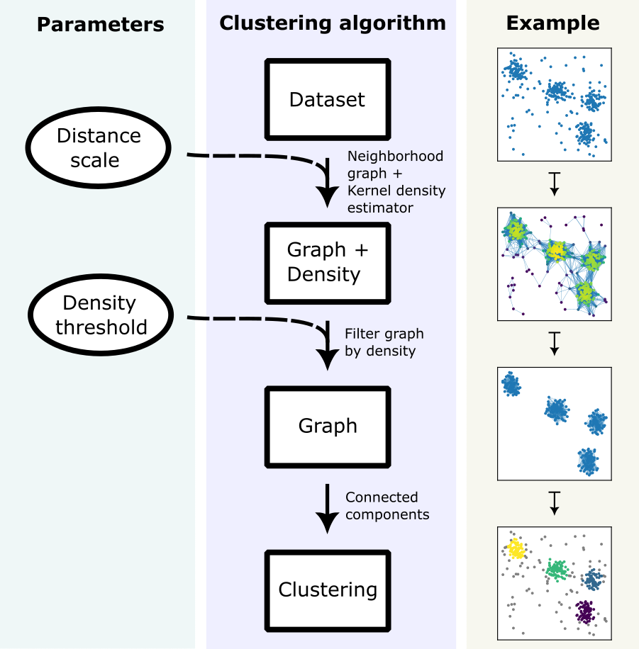
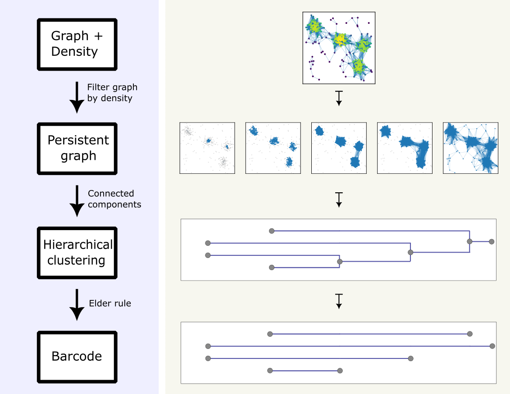

Density-based clustering and persistence
========================================

Under construction.

Density-based clustering
------------------------

A common way of doing density-based clustering consists of constructing a graph
over the input data and to subsequently filter this graph by density and compute
the connected components of the filtered graph. A variation of this scheme underlies,
for instance, the well-known algorithm DBSCAN.

Typically, two parameters must be chosen by the user: a **distance scale**, which is
used to construct the graph and the density estimate, as well as a **density threshold**,
used to filter the graph. The figure below summarizes this pipeline.

   A typical density-based clustering scheme, which requires the user to choose two parameters.

Persistence
-----------

Persistence refers to the study of mathematical objects, such as graphs, that
change as one or more parameters are varied. Persistence is relevant to us since,
as we saw above, in order to get a clustering we needed to fix two parameters.
Let us see here how persistence can help understand a graph together with a density,
as a whole, without having to fix any specific density threshold.

In order to do this, we filter the graph by all possible density thresholds,
which results in a persistent graph. The connected components of this persistent
graph determine a *hierarchical clustering* of the dataset. Persistence theory
summarizes a hierachical clustering with a *barcode*, which is just a finite
set of intervals that we interpret as follows: long bars correspond to
clusters/connected components that are present at many stages of the persistent
graph, while short bars represent noise in the data.

   A barcode representing how the connected components of a filtered graph vary.
   Since the dataset is fairly clean, there are only long bars, which represent
   the four clusters one would expect.

Multi-parameter persistence
---------------------------

Under construction.
