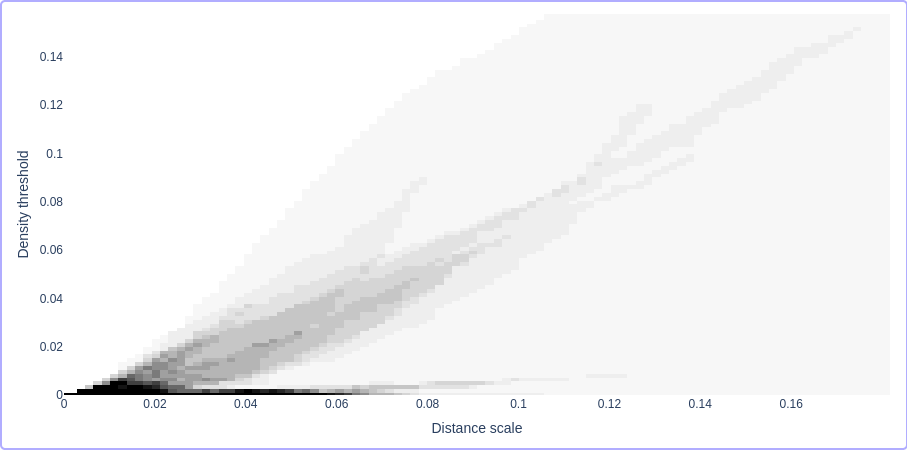
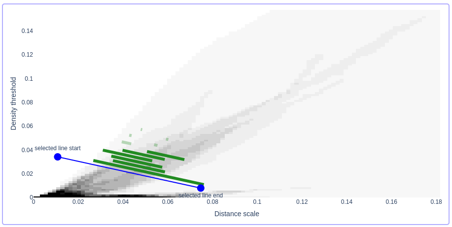

.. _introduction:

Introduction to Persistable
===========================

This tutorial explains how Persistable works. 
We'll focus especially on Persistable's 
interactive parameter selection features. 
See :ref:`quick-start` for a fast introduction to using the software.

As a running example, we'll use a synthetic dataset from 
`the hdbscan GitHub repository <https://github.com/scikit-learn-contrib/hdbscan>`_. 
This is a great test dataset, since it is quite challenging for most clustering algorithms, 
but easy to visualize.

.. code:: python

	import numpy as np
	import matplotlib.pyplot as plt
	from urllib.request import urlopen
	from io import BytesIO
	
	# fetch the data from the hdbscan repo
	url = "https://github.com/scikit-learn-contrib/hdbscan/blob/4052692af994610adc9f72486a47c905dd527c94/notebooks/clusterable_data.npy?raw=true"
	f = urlopen(url)
	rf = f.read()
	data = np.load(BytesIO(rf))

	# plot the data
	plt.figure(figsize=(10,10))
	plt.scatter(data[:,0], data[:,1], alpha=0.5)
	plt.show()

.. figure:: pictures/hdbscan_data.png
    :align: center

--------------------------------
Background: the DBSCAN algorithm
--------------------------------

To understand how Persistable works, 
it's helpful to first understand 
`the DBSCAN algorithm <https://dl.acm.org/doi/10.5555/3001460.3001507>`_, 
perhaps the best-known approach to density-based clustering. 
(In fact, we will discuss a minor modification of the original algorithm, 
sometimes called DBSCAN*. This handles the so-called "border" points 
in a way that is more consistent with a statistical intepretation 
of clustering in terms of level sets of a density.) 

Say our data comes in the form of a finite set of points *X* with a metric 
(like the points plotted in 2D above). 
The parameters of DBSCAN are a distance scale *s* 
(sometimes called epsilon) 
and a density threshold *k* 
(sometimes called min_samples). 
Now, the "core points" *C(X)* are those points of *X* 
with at least *k* neighbors in their *s*-neighborhood:

.. math::

	C(X)_{s,k} = \{ x \in X : |B(x,s)| \geq k \}.
	
Here, *B(x,s)* is the set of points whose distance from *x* 
is no more than *s*.

The DBSCAN graph |graph| takes these core points as vertices, 
and puts an edge between two core points 
if the distance between them is no more than *s*:

.. math::

	\mathsf{vertices} \; G(X)_{s,k} &= C(X)_{s,k}. \\
	\mathsf{edges} \; G(X)_{s,k} &= 
	\{ \{x,y\} \in C(X)_{s,k} : d(x,y) \leq s \}.
	
Now, the DBSCAN clustering of *X* 
(with respect to *s* and *k*) 
is just the set of connected components 
of the DBSCAN graph |graph|.

As the values of the parameters *s* and *k* vary, 
we get a whole hierarchy of graphs 
that encode cluster structure in the data. 
These are hierarchical in the sense that if two data points 
are clustered together in the graph |graph|, 
then they remain together 
for any larger *s* or smaller *k*.

We can get a feel for this 2-parameter hierarchy of graphs 
by plotting the **component counting function**: 
for each *(s,k)*, we simply count the number of 
components in the graph |graph|.

.. |graph| raw:: html

	<em>G(X)s,k</em>
	
.. |graphr| raw:: html

	<em>G(X)r</em>

    The component counting function of our running example. 
    The darker the shade of grey, the more components.
	
In this plot, we see the typical behavior of 
the DBSCAN graphs. 
When *s* is small and *k* is large, 
no points qualify as core points, 
and we see no clusters. 
When *s* is large and *k* is small, 
we have many core points and many edges, 
and the graph |graph| is connected. 

In between these two regimes, there is a band 
in which interesting things are happening.

As a descriptor of our data, 
the component counting function is usually too 
coarse to really see what's going on. 
But at least it gives us an idea of 
the range of values of *s* and *k* 
that lead to interesting cluster structure.

Rather than fix a single choice of the parameters *s* and *k* 
like DBSCAN, Persistable takes a multi-scale approach, 
which we will describe next.

.. _introduction-clustering-with-persistable:

---------------------------
Clustering with Persistable
---------------------------

Conceptually, Persistable constructs a single clustering of data 
from the DBSCAN graphs in two steps.

**Step 1:**  Reduce from the 2-parameter hierarchy of graphs *G(X)* 
to a 1-parameter hierarchy by taking a *slice*.

A slice is defined by a line in the *(s,k)*-space:
   
.. math::
   
	k = ms + b \; \; \text{ with } \; m < 0 \; 
	\text{ and } \; b > 0
   	
which gives us a 1-parameter hierarchy of graphs:
   
.. math::
   
	G(X)_{r} = G(X)_{r, mr + b} \, .
    
We always take *m* < 0, so that *k* decreases as *s* increases. 
This has the effect that, as *r* increases, 
it gets easier for points of |graphr| 
to be in the same component. 
We get a 1-parameter hierarchical clustering of the data 
by taking the components of |graphr|.

Since *k* and *s* both change with *r*, 
this hierarchical clustering reflects cluster structure 
at a range of density thresholds and distance scales.

    A slice of *G(x)* is plotted in blue, 
    along with its barcode, in green.
    
An important feature of Persistable is an interactive tool 
for choosing slices. 
We'll discuss this tool, 
and how to choose a slice in practice, 
after we discuss the second step of Persistable.
   
**Step 2:** Extract a single clustering of the data 
from the 1-parameter slice 
using the notion of *persistence* 
from topological data analysis.

In the picture above, 
a slice of *G(X)* is plotted in blue, 
and its *barcode* is plotted in green. 
The barcode of a 1-parameter hierarchical clustering 
is a visualizable summary of the hierarchy. 
A bar is born when a cluster is born in the hierarchy, 
and when two clusters merge, 
one of the corresponding bars ends, 
according to the Elder rule. 
For more on this construction, see 
:ref:`barcode`.

In this example, there are six fairly long bars 
(in dark green), as well as some shorter bars (in light green). 
Longer bars represent clusters that survive across a bigger range of scales, 
and are thus more likely to represent real structure in the data, 
rather than an artifact of the algorithm. 

To get a clustering of the data from the slice, 
we only have to choose how many bars we want to keep. 
If we choose *n* bars, 
the output of Persistable will consist of *n* clusters. 
These clusters correspond to the *n* longest bars in the barcode, 
so the strategy is to look at the barcode and try to draw a line 
between long bars and short bars.

In this example, 6 bars is a reasonable choice. 
Now, the *persistence-based flattening algorithm* 
extracts a clustering with 6 clusters. 
See :ref:`persistence-based-flattening` 
for a description of this algorithm.

Going back to our example dataset, 
we get the following result 
(gray points do not belong to any cluster):

.. figure:: pictures/hdbscan_data_clustered.png
    :align: center

----------------
Choosing a slice
----------------

Persistable's interactive mode provides several visualization tools 
that help the user choose a slice.
The rest of this tutorial is an introduction to these tools. 
For a quick guide, see :ref:`quick-start`.

To plot the component counting function using Persistable, 
we use Persistable's interactive mode:
	
.. code:: python

	p = persistable.Persistable(data, n_neighbors="all")
	pi = persistable.PersistableInteractive(p)
	port = pi.start_UI()
	
The variable ``port`` contains the port in ``localhost`` serving the GUI, which
``8050`` by default, but may be different if that port is in use.
Accessing ``localhost:[port]`` opens a window that is initially pretty empty:

.. figure:: pictures/interactive_mode_initial.png
    :align: center
    
To get started, press the "Compute" button 
under "Component Counting Function". 
After the computation is finished, 
you should see a plot of the component counting function:
	
.. figure:: pictures/interactive_mode_cc.png
    :align: center
	
To zoom in or out, adjust the parameters in the "Inputs" box.

The component counting function can give us an idea of 
where the interesting cluster structure is, 
but just from looking at this plot, 
it's not usually clear which slice we want to choose.
	
The next step in Persistable's interactive mode is the 
**Prominence Vineyard**. 
To use this tool, choose *two* slices:

.. figure:: pictures/interactive_mode_choose_vineyard_params.png
    :align: center
    
To do this, turn the "Vineyard inputs selection" on, 
and choose the slices by choosing their endpoints. 	
You can choose the endpoints by clicking on 
the component counting function plot, 
or by entering the coordinates of the endpoints 
in the "Inputs" box under "Prominence Vineyard".

It's often a good strategy to choose the first slice 
in a region with many clusters, and the second slice 
in a region with few clusters, as above.

Now press "Compute" under "Prominence Vineyard". 
After the computation is complete, 
the vineyard is displayed:
	
.. figure:: pictures/vineyard_closeup.png
    :align: center
	
What is the meaning of this plot?

First, recall that the barcode of a hierarchical clustering 
gives us a coarse summary of its structure. 
We can get an even coarser summary by just remembering the 
length of each bar, which is also called the 
*prominence* of the bar. 
This list of prominences tells us how many clusters 
are in the hierarchy, and how long each one persists in the hierarchy.

Now, the Prominence Vineyard is constructed by taking a 
family of slices that interpolate between the two user-selected slices, 
and for each interpolating slice, 
plotting the prominences of the bars in its barcode. 
These prominences trace out curves that we call *vines*. 
The result is a visual summary of how the hierarchical clustering we get 
changes as we change the slice.

To get a clustering of the data, 
all we have to do now is choose a slice and choose how many 
bars (i.e., clusters) to keep. 
Recall that we are looking to draw a line between long bars and short bars. 
In the Prominence Vineyard plot, this corresponds to a gap between 
large and small prominences. 

To choose a slice and a gap, turn on the "Parameter selection" option 
under "Prominence Vineyard".

In this example, we see a huge gap between the largest and second-largest 
vines. This is typical, since the most prominent bar in a hierarchical 
clustering is typically much longer than all the others. 
After this, the gap between the 6th and 7th vines stands out:

.. figure:: pictures/vineyard-6-clusters-lin.png
    :align: center

This is particularly noticeable if we display prominences 
on log scale, using the option in the "Inputs" box 
under "Prominence Vineyard":

.. figure:: pictures/vineyard-6-clusters-log.png
    :align: center

Setting the "Gap number" to 6 and choosing a slice 
(i.e., a vertical line in the Prominence Vineyard plot) 
where this gap is large, 
we've made all the choices we need to get a clustering. 
So, press the "Choose parameter" button.

Now where's the clustering? 
We can get cluster labels for the data points 
from the PersistableInteractive object:

.. code:: python

	cluster_labels = pi.cluster()

Points labelled -1 are noise, 
and the clusters are labelled starting from 0.
We can visualize the result by plotting the points 
with colors corresponding to the labels:

.. code:: python

	# choose color map
	import matplotlib
	cNorm  = matplotlib.colors.Normalize(vmin=0, vmax=np.amax(cluster_labels))
	scalarMap = matplotlib.cm.ScalarMappable(norm=cNorm, cmap='Paired')
	noise_color = (211/255, 211/255, 211/255, 1) # light grey

	# plot data with clusters indicated by colors
	plt.figure(figsize=(10,10))
	plt.scatter(data[:,0], data[:,1], c=[noise_color if x==-1 else scalarMap.to_rgba(x) for x in cluster_labels], alpha=0.5)

	plt.show()

.. figure:: pictures/hdbscan_data_clustered.png
    :align: center
