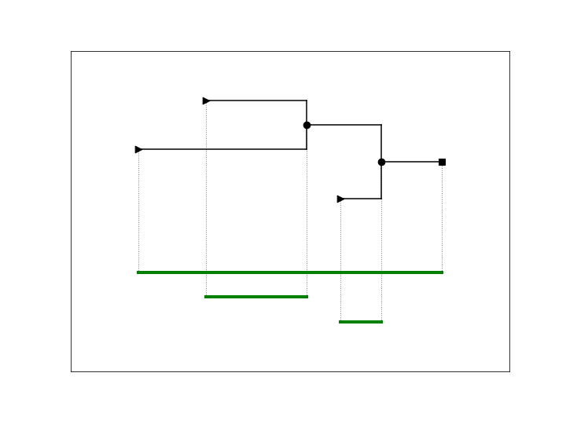
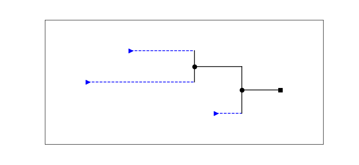
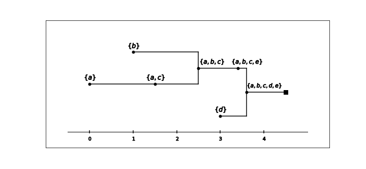
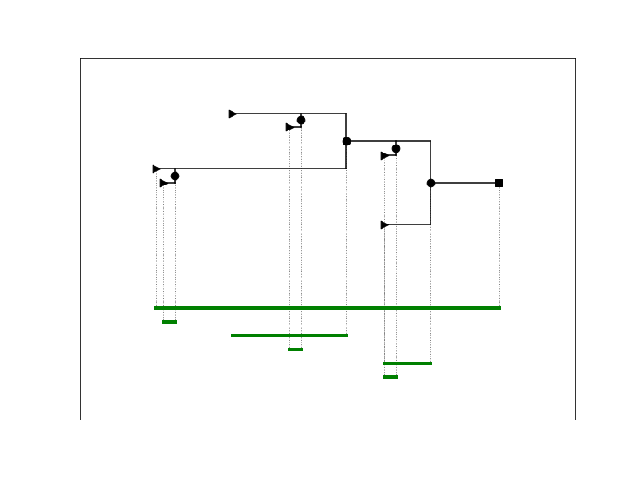
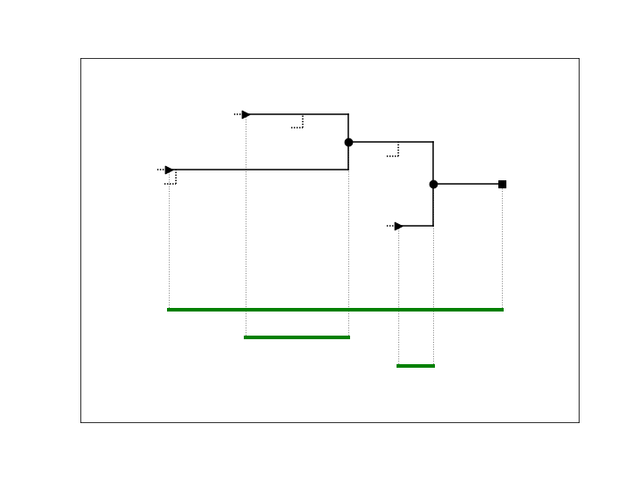
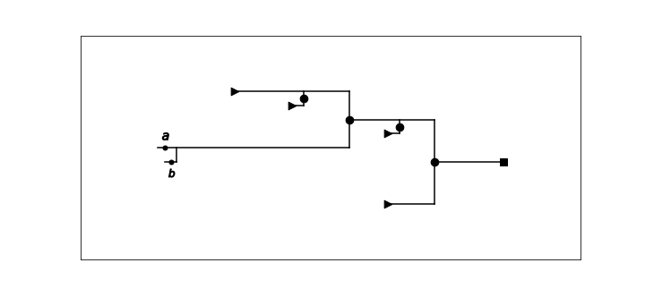
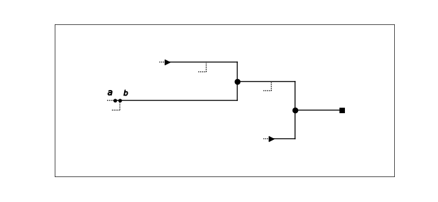
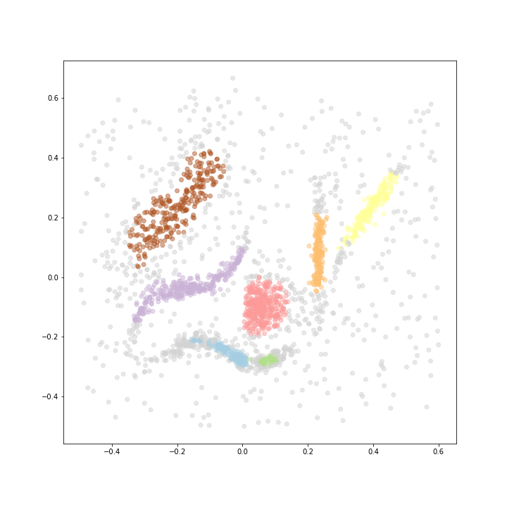

.. _persistence-based-flattening:

The persistence-based flattening algorithm
==========================================

Given a hierarchical clustering of data, 
the persistence-based flattening algorithm extracts a single clustering 
of the data. We call this a "flattening" algorithm 
because it reduces a 1-parameter hierarchical clustering to 
a flat (0-parameter) clustering.

This tutorial provides a short description of the 
persistence-based flattening algorithm. 
For details, see Section 5 
`here <https://arxiv.org/abs/2005.09048>`_. 
This method is inspired by the ToMATo algorithm; 
see :ref:`links`.

The term "persistence" comes from the theory of persistent homology, 
and in particular, we will use the *barcode* of a hierarchical clustering 
to describe this algorithm:

    
    A schematic picture of a hierarchical clustering (in black), 
    and its barcode (in green).
    
See :ref:`barcode` for an introduction to this notion.

A simple flattening algorithm is to just take the *leaves* 
of the hierarchical clustering (the blue dashed edges):

    
Recall that bars in the barcode are created whenever a 
new cluster enters the hierarchy, 
so the bars are in one-to-one correspondence with the leaves 
of the hierarchical clustering. 
    
To be more explicit, 
let's add some data points to this picture:

The picture represents a hierarchical clustering of the set 
*{a,b,c,d,e}*. Point *a* enters the hierarchy at the parameter *r = 0*, 
and point *b* enters at *r=1*. 
At *r=1.5*, point *c* enters the hierarchy, and is immediately clustered with 
*a*. The clusters *{a,c}* and *{b}* merge at *r=2.5*, and so on.

The clustering of the data we get by taking the leaves has three clusters: 
*{a,c}*, *{b}*, and *{d}*. The point *e* is not assigned to any cluster, 
since it never lived inside a leaf.

A nice property of the leaf clustering is that it can identify cluster 
structure happening at different scales. 
In this example, once the point *d* has entered 
the hierarchy, points *a*, *b*, and *c* are all clustered together. 
So, we can't get the leaf clustering just by fixing a value of *r* 
and taking the hierarchical clustering at that value.

However, the leaf clustering can give poor results if the 
hierarchy has many spurious leaves, as in this example:
    

    
The persistence-based flattening attempts to avoid this problem by 
first *pruning* the hierarchy, and then taking the leaf clustering. 
For this we use the barcode of the hierarchical clustering 
as a visual guide.

In the example above, we might guess that the three very short bars 
correspond to spurious leaves. 
So, we can choose a value *t* that is greater than the length of 
the three short bars, and prune the hierarchy by 
shortening each leaf by *t*:

    
To see what happens to the data points inside the leaves, 
consider data points *a* and *b* living inside different leaves 
in the original hierarchical clustering: 

    
After pruning, these points are pushed rightwards along the hierarchy, 
and live inside the same leaf:
    

    
Notice that, when we prune before taking the leaf clustering, 
we're not just removing low-persistence clusters from the end result. 
Since these low-persistence leaves can "interrupt" high-persistence 
leaves, pruning allows larger clusters to form.

As an example, consider the dataset from :ref:`introduction`. 
There, we considered a hierarchical clustering obtained 
by taking a slice of the DBSCAN graphs:

.. figure:: pictures/component_counting_slice.png
    :align: center
    
If we choose to keep 7 bars, 
the persistence-based flattening produces the following result:

     
If we choose to keep only 6 bars, 
the two clusters at the bottom are able to merge:

.. figure:: pictures/hdbscan_data_clustered.png
    :align: center
