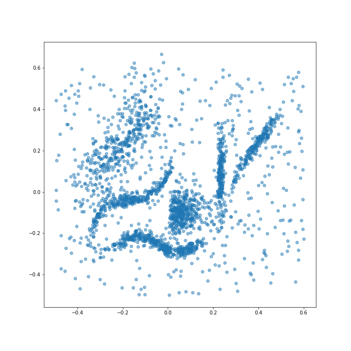
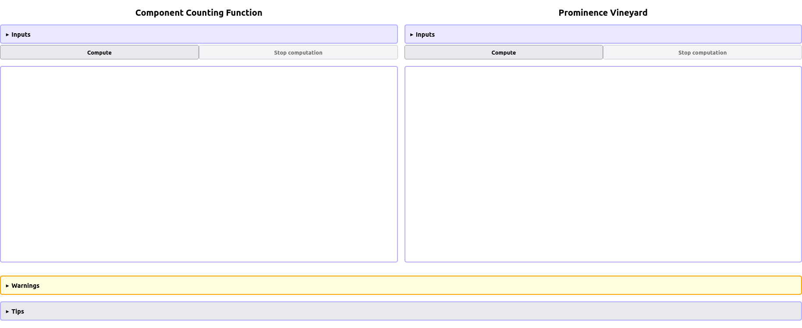
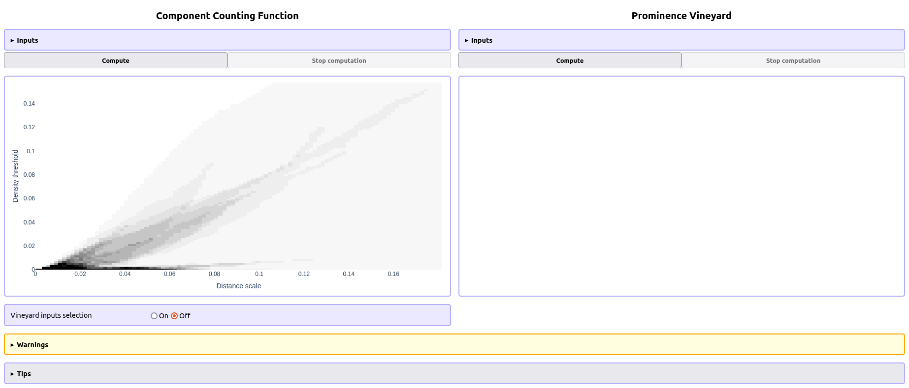
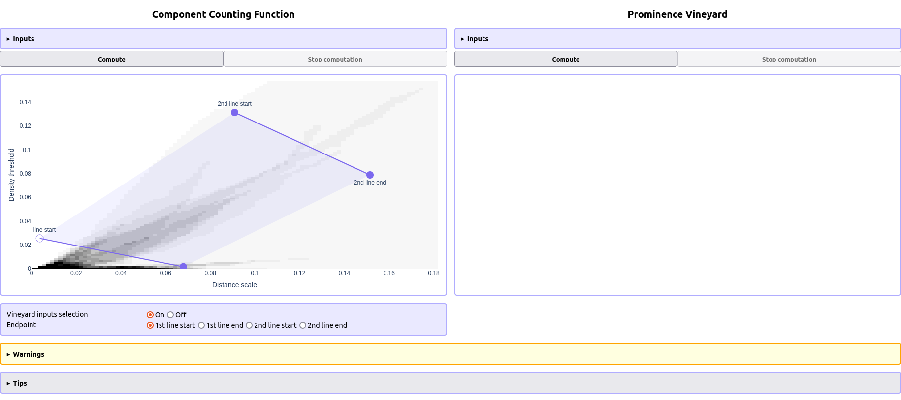
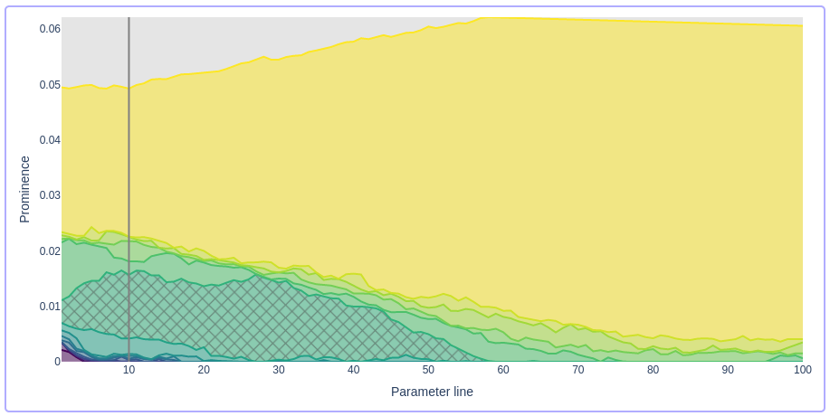
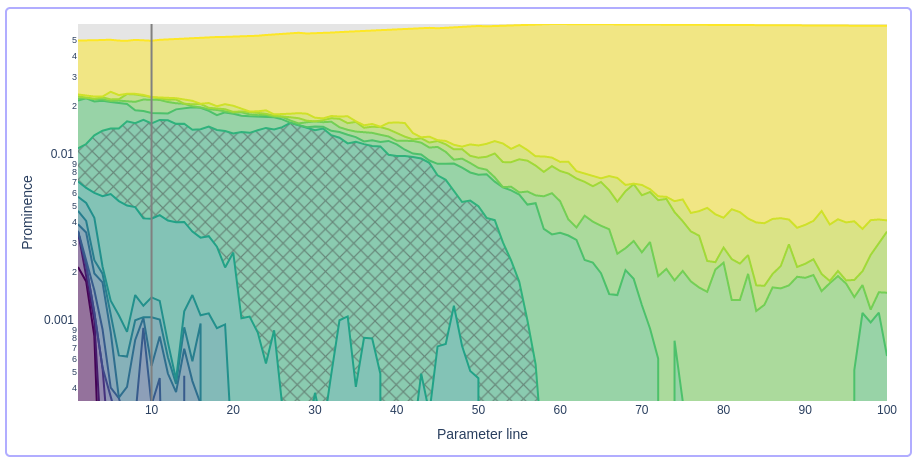
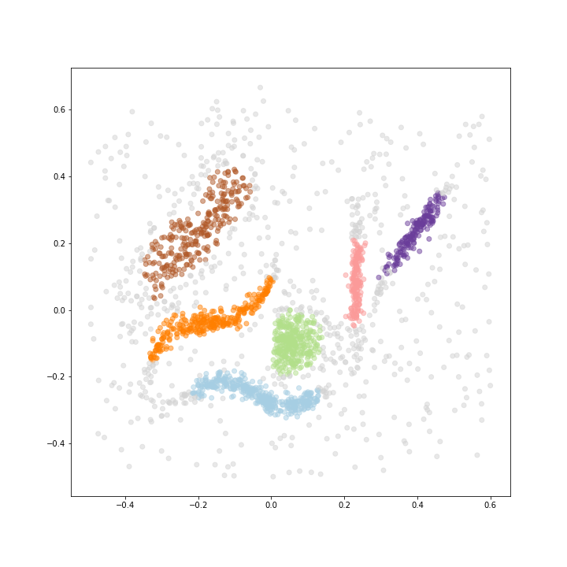

.. _quick-start:

Quick start
===========

This is a quick guide to using Persistable's interactive mode. 
For a more thorough introduction, see 
:ref:`introduction`.

As a running example, we'll use a synthetic dataset from 
`the hdbscan GitHub repository <https://github.com/scikit-learn-contrib/hdbscan>`_. 
This is a great test dataset, since it is quite challenging for most clustering algorithms, 
but easy to visualize.

.. code:: python

	import numpy as np
	import matplotlib.pyplot as plt
	from urllib.request import urlopen
	from io import BytesIO
	
	# fetch the data from the hdbscan repo
	url = "https://github.com/scikit-learn-contrib/hdbscan/blob/4052692af994610adc9f72486a47c905dd527c94/notebooks/clusterable_data.npy?raw=true"
	f = urlopen(url)
	rf = f.read()
	data = np.load(BytesIO(rf))

	# plot the data
	plt.figure(figsize=(10,10))
	plt.scatter(data[:,0], data[:,1], alpha=0.5)
	plt.show()

To get started, create a Persistable object:

.. code:: python

	p = persistable.Persistable(data, n_neighbors="all")
	
The ``n_neighbors`` parameter gives an upper bound on how many neighbors 
of a data point we consider in all future computations. 
Persistable primarily looks at the nearest neighbors of a data point 
to estimate density, 
so it suffices to look at a local neighborhood of the point. 
Thus ``n_neighbors`` can be a small fraction of the total size of the dataset. 
If the dataset is small and you aren't worried about computation time, 
you can set ``n_neighbors`` to ``"all"``.

Next we launch Persistable's interactive mode:
	
.. code:: python

	pi = persistable.PersistableInteractive(p)
	port = pi.start_UI()
	
The variable ``port`` contains the port in ``localhost`` serving the GUI, which
``8050`` by default, but may be different if that port is in use.
Accessing ``localhost:[port]`` opens a window that is initially pretty empty:

    
To get started, press the "Compute" button 
under "Component Counting Function". 
After the computation is finished, 
you should see a plot of the component counting function:
	

To zoom in or out, adjust the parameters in the "Inputs" box.
	
The component counting function shows how many clusters the data has, 
with respect to a distance scale parameter (horizontal axis) 
and a density threshold (vertical axis). 
These are closely related to the parameters of the DBSCAN clustering algorithm. 
See :ref:`introduction` for more details.

Unlike DBSCAN, Persistable will not fix either of these parameters. 
Instead, the output of Persistable will depend on 
a "slice" of this parameter space: 
a line running down and to the right. 
Any slice determines a hierarchical clustering of the data.
	
The next step in Persistable's interactive mode is the 
**Prominence Vineyard**. 
To use this tool, choose *two* slices:

    
To do this, turn the "Vineyard inputs selection" on, 
and choose the slices by choosing their endpoints. 	
You can choose the endpoints by clicking on 
the component counting function plot, 
or by entering the coordinates of the endpoints 
in the "Inputs" box under "Prominence Vineyard".

It's often a good strategy to choose the first slice 
in a region with many clusters, and the second slice 
in a region with few clusters, as above.

Now press "Compute" under "Prominence Vineyard". 
After the computation is complete, 
the vineyard is displayed:
	

	
The Prominence Vineyard is constructed by taking a 
family of slices that interpolate between the two user-selected slices.
The curves ("vines") in the Prominence Vineyard represent clusters 
in the data that evolve with the choice of slice. 
The larger their prominence value (plotted on the vertical axis), 
the more likely they are to represent real structure in the data.

To get a clustering, turn on the "Parameter selection" option 
under "Prominence Vineyard". 
The "Gap number" determines the number of clusters in the output. 
As you change this number, the corresponding "gap" in the 
Prominence Vineyard is marked. Here we have gap number 6:

    
The larger the gap you choose, the more stable the resulting clustering will be; 
thus, it's usually a good idea to choose a large gap: 
a gap that extends over many slices (horizontally), 
and that covers a large range of prominence values (vertically). 

When looking for a clustering with more than 2 or 3 clusters, 
it's often helpful to display the prominences in log scale, 
using the option in the "Inputs" box under "Prominence Vineyard":

After choosing a gap number, choose a slice where this gap is large, 
and you've made all the choices necessary to get a clustering. 
So, press the "Choose parameter" button.

Now where's the clustering? 
You can get cluster labels for the data points 
from the PersistableInteractive object:

.. code:: python

	labels = pi.cluster()

Points labelled -1 are unclustered (noise), 
and the clusters are labelled starting from 0.
On our running example, we can visualize the result by plotting the points 
with colors corresponding to the labels:

.. code:: python

	# choose color scheme
	import matplotlib
	cNorm  = matplotlib.colors.Normalize(vmin=0, vmax=np.amax(labels))
	scalarMap = matplotlib.cm.ScalarMappable(norm=cNorm, cmap='Paired')
	noise_color = (211/255, 211/255, 211/255, 1) # light grey
	colors = [noise_color if x==-1 else scalarMap.to_rgba(x) for x in labels]

	# plot data with clusters indicated by colors
	plt.figure(figsize=(10,10))
	plt.scatter(data[:,0], data[:,1], c=colors, alpha=0.5)

	plt.show()

